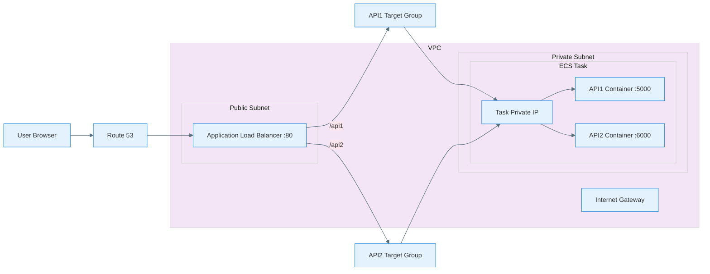

# ECS Fargate Multi Container API Architecture

## High Level Design

---

## Architecture Overview

This project implements a containerized backend application deployed on AWS using ECS Fargate behind an Application Load Balancer. The frontend interacts with backend APIs through a public endpoint exposed securely using AWS networking components.

User requests are first resolved through Route 53 which maps the application domain name to the public endpoint of the Application Load Balancer. The load balancer is deployed within a public subnet of a Virtual Private Cloud and acts as the entry point for all incoming internet traffic.

Based on path based routing rules the load balancer forwards incoming requests to the appropriate target group. Each target group corresponds to a specific backend API running inside containers that are deployed as part of an ECS Fargate task within a private subnet.

The ECS task hosts multiple containers each responsible for handling a separate API endpoint. These containers share a common task level network interface with a private IP address enabling secure internal communication while remaining inaccessible directly from the internet.

Security groups are configured to allow public traffic to reach the load balancer while restricting backend container access to only the load balancer ensuring that application services remain private and protected within the VPC.

This architecture enables secure exposure of backend services to external clients while maintaining network isolation for internal application components.

---

## Low Level Design

**InfraStack** `extends` Stack — main CDK stack class that owns and wires together every AWS resource in this project.

**Vpc** — creates the isolated network boundary with 2 public subnets across 2 availability zones and no NAT gateway to keep costs minimal.

**SecurityGroup — alb_sg** — controls who can reach the ALB, allowing only inbound TCP 80 from the public internet.

**SecurityGroup — ecs_sg** — locks down Fargate tasks so only the ALB security group can reach them on ports 5000 and 6001, never the public internet directly.

**ApplicationLoadBalancer** — the single public entry point for all traffic, spanning both availability zones for high availability.

**ApplicationListener** — sits on port 80 of the ALB and holds the path-based routing rules that decide which target group each request goes to.

**ApplicationTargetGroup — tg1** — tracks healthy Fargate tasks for API1 on port 5000 and health checks them via GET /api1.

**ApplicationTargetGroup — tg2** — tracks healthy Fargate tasks for API2 on port 6001 and health checks them via GET /api2.

**IAM Role — exec_role** — grants ECS the minimum permissions needed to pull images from ECR and write logs to CloudWatch.

**FargateTaskDefinition — api1_task** — defines the resource envelope for API1 containers, 256 CPU units and 512MB memory per task.

**FargateTaskDefinition — api2_task** — defines the resource envelope for API2 containers, 256 CPU units and 512MB memory per task.

**ContainerDefinition — api1** — tells ECS which ECR image to run for API1, which port to expose, and where to send logs.

**ContainerDefinition — api2** — tells ECS which ECR image to run for API2, which port to expose, and where to send logs.

**FargateService — api1_service** — keeps one API1 task running at all times and registers it with tg1 so the ALB can route to it.

**FargateService — api2_service** — keeps one API2 task running at all times and registers it with tg2 so the ALB can route to it.

**CfnOutput** — prints the ALB DNS name to the terminal after `cdk deploy` so you can immediately test the endpoints.
