# ECS Fargate Multi Container API Architecture

## High Level Design

---

## Architecture Overview

This project implements a containerized backend application deployed on AWS using ECS Fargate behind an Application Load Balancer. The frontend interacts with backend APIs through a public endpoint exposed securely using AWS networking components.

User requests are first resolved through Route 53 which maps the application domain name to the public endpoint of the Application Load Balancer. The load balancer is deployed within a public subnet of a Virtual Private Cloud and acts as the entry point for all incoming internet traffic.

Based on path based routing rules the load balancer forwards incoming requests to the appropriate target group. Each target group corresponds to a specific backend API running inside containers that are deployed as part of an ECS Fargate task within a private subnet.

The ECS task hosts multiple containers each responsible for handling a separate API endpoint. These containers share a common task level network interface with a private IP address enabling secure internal communication while remaining inaccessible directly from the internet.

Security groups are configured to allow public traffic to reach the load balancer while restricting backend container access to only the load balancer ensuring that application services remain private and protected within the VPC.

This architecture enables secure exposure of backend services to external clients while maintaining network isolation for internal application components.

---

## Low Level Design

```mermaid
%%{init: {'theme':'base', 'themeVariables': {
'primaryColor': '#e3f2fd',
'primaryBorderColor': '#1e88e5',
'lineColor': '#546e7a',
'secondaryColor': '#fce4ec',
'tertiaryColor': '#f3e5f5',
'fontSize': '14px'
}}}%%
flowchart LR

User["👤 User Browser\nfetch /api1 or /api2"]

subgraph VPC["VPC (10.0.0.0/16)"]

    IGW["Internet Gateway"]

    subgraph PubSubnets["Public Subnets (AZ1 + AZ2)"]
        ALB["Application Load Balancer :80\n─────────────────\nListener Rule 1: /api1* → TG1\nListener Rule 2: /api2* → TG2\nDefault: 404"]
    end

    subgraph SGLayer["Security Groups"]
        ALBSG["ALB SG\nInbound: TCP 80 from 0.0.0.0/0"]
        ECSSG["ECS SG\nInbound: TCP 5000 from ALB SG\nInbound: TCP 6001 from ALB SG"]
    end

    subgraph ECSCluster["ECS Fargate Cluster"]

        subgraph SVC1["Fargate Service 1"]
            TASK1["Task Definition\ncpu: 256 mem: 512MB\n─────────────\nContainer: container_a\nImage: ECR api1:latest\nPort: 5000\nLogs: CloudWatch /api1"]
        end

        subgraph SVC2["Fargate Service 2"]
            TASK2["Task Definition\ncpu: 256 mem: 512MB\n─────────────\nContainer: container_b\nImage: ECR api2:latest\nPort: 6001\nLogs: CloudWatch /api2"]
        end

    end

    subgraph TGs["Target Groups"]
        TG1["Target Group 1\nPort: 5000 | Protocol: HTTP\nTarget Type: IP\nHealth Check: GET /api1"]
        TG2["Target Group 2\nPort: 6001 | Protocol: HTTP\nTarget Type: IP\nHealth Check: GET /api2"]
    end

end

subgraph ECR["ECR — Private Registry"]
    IMG1["api1:latest"]
    IMG2["api2:latest"]
end

IAM["IAM Exec Role\nAmazonECSTaskExecutionRolePolicy\nAllows: ECR pull + CloudWatch logs"]

User -->|"HTTPS GET /api1 or /api2"| IGW
IGW --> ALB
ALB -->|"path: /api1*\npriority 1"| TG1
ALB -->|"path: /api2*\npriority 2"| TG2
TG1 -->|"health check pass"| TASK1
TG2 -->|"health check pass"| TASK2
IMG1 -.->|"pulled at task start"| TASK1
IMG2 -.->|"pulled at task start"| TASK2
IAM -.->|"grants ECR + CW access"| TASK1
IAM -.->|"grants ECR + CW access"| TASK2
TASK1 -->|"Hello from API1"| User
TASK2 -->|"Hello from API2"| User
```

